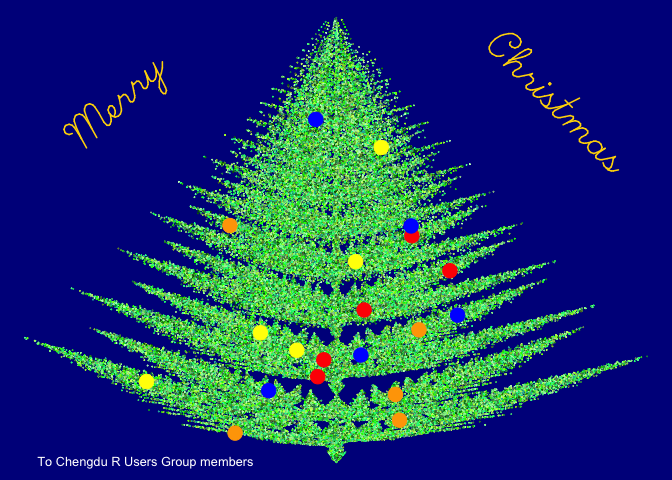
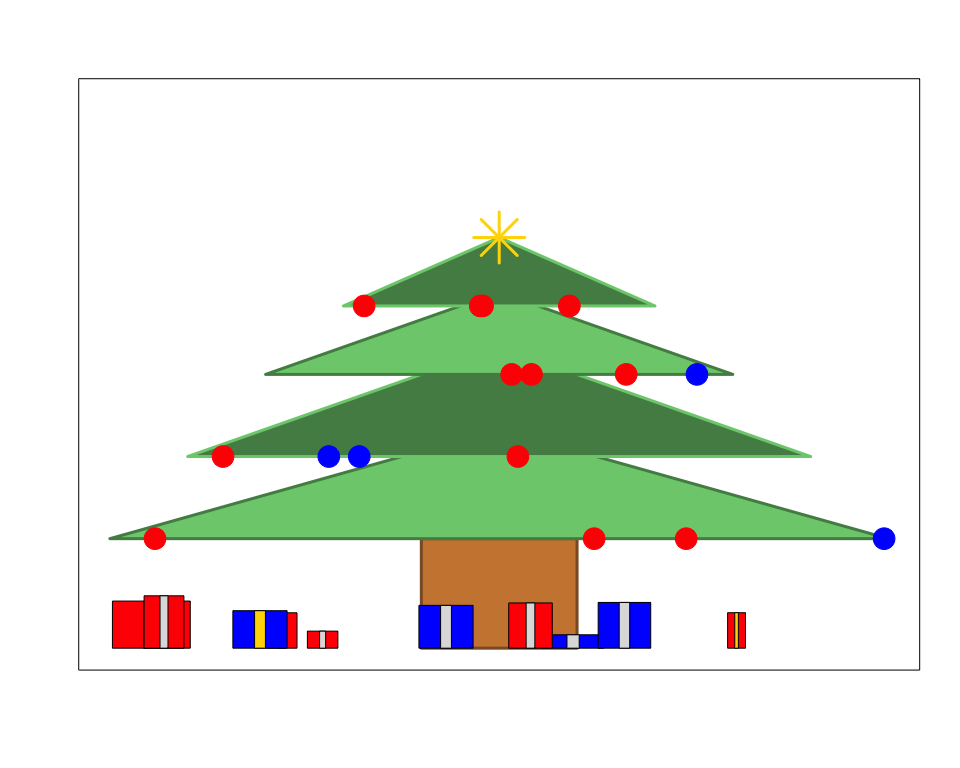

A collection of Christmas Trees with R
================
Anna Quaglieri

-   From <https://github.com/STATWORX/xmas/blob/master/xmas.r>

``` r
xmas <- function(N){
  # Filler and blanks
  filler = "*"
  blank = ""
  # Draw
  for (i in 1:N){
    row <- c(rep(blank, N-i), rep(filler, i), rep(blank, N-i))
    cat(row,"\n")
  }   
  cat(c(rep(blank, N-1), rep(filler, 1), rep(blank, N-1)),"\n")
  cat("Merry Christmas from the R-Ladies Melbourne :)")
}
xmas(10)
```

    ##          *          
    ##         * *         
    ##        * * *        
    ##       * * * *       
    ##      * * * * *      
    ##     * * * * * *     
    ##    * * * * * * *    
    ##   * * * * * * * *   
    ##  * * * * * * * * *  
    ## * * * * * * * * * * 
    ##          *          
    ## Merry Christmas from the R-Ladies Melbourne :)

Christmas Trees
===============

-   [A fractal Christmas Tree](https://gist.github.com/toddleo/61dc86f7012a728944f2)

``` r
# http://www.r-bloggers.com/merry-christmas-5/?utm_source=feedburner&utm_medium=feed&utm_campaign=Feed%3A+RBloggers+%28R+bloggers%29
# Each row is a 2x2 linear transformation 
# Christmas tree 
L <-  matrix(
    c(0.03,  0,     0  ,  0.1,
        0.85,  0.00,  0.00, 0.85,
        0.8,   0.00,  0.00, 0.8,
        0.2,  -0.08,  0.15, 0.22,
        -0.2,   0.08,  0.15, 0.22,
        0.25, -0.1,   0.12, 0.25,
        -0.2,   0.1,   0.12, 0.2),
    nrow=4)
# ... and each row is a translation vector
B <- matrix(
    c(0, 0,
        0, 1.5,
        0, 1.5,
        0, 0.85,
        0, 0.85,
        0, 0.3,
        0, 0.4),
    nrow=2)

prob = c(0.02, 0.6,.08, 0.07, 0.07, 0.07, 0.07)

# Iterate the discrete stochastic map 
N = 1e5 #5  #   number of iterations 
x = matrix(NA,nrow=2,ncol=N)
x[,1] = c(0,2)   # initial point
k <- sample(1:7,N,prob,replace=TRUE) # values 1-7 

for (i in 2:N) 
  x[,i] = crossprod(matrix(L[,k[i]],nrow=2),x[,i-1]) + B[,k[i]] # iterate 

# Plot the iteration history 
par(bg='darkblue',mar=rep(0,4))    
plot(x=x[1,],y=x[2,],
    col=grep('green',colors(),value=TRUE),
    axes=FALSE,
    cex=.1,
    xlab='',
    ylab='' )#,pch='.')

bals <- sample(N,20)
points(x=x[1,bals],y=x[2,bals]-.1,
    col=c('red','blue','yellow','orange'),
    cex=2,
    pch=19
)
text(x=-.7,y=8,
    labels='Merry',
    adj=c(.5,.5),
    srt=45,
    vfont=c('script','plain'),
    cex=3,
    col='gold'
)
text(x=0.7,y=8,
    labels='Christmas',
    adj=c(.5,.5),
    srt=-45,
    vfont=c('script','plain'),
    cex=3,
    col='gold'
)
text(x=-0.6,y=0,
     cex=0.8,
     labels="To Chengdu R Users Group members",
     col="white"
)
```



-   [A Simpler Christmas Tree](https://gist.github.com/jtleek/4369771)

``` r
# Make the canvas
plot(1:10,1:10,xlim=c(-5,5),ylim=c(0,10),type="n",xlab="",ylab="",xaxt="n",yaxt="n")
# Make the branches
rect(-1,0,1,2,col="tan3",border="tan4",lwd=3)
polygon(c(-5,0,5),c(2,4,2),col="palegreen3",border="palegreen4",lwd=3)
polygon(c(-4,0,4),c(3.5,5.5,3.5),col="palegreen4",border="palegreen3",lwd=3)
polygon(c(-3,0,3),c(5,6.5,5),col="palegreen3",border="palegreen4",lwd=3)
polygon(c(-2,0,2),c(6.25,7.5,6.25),col="palegreen4",border="palegreen3",lwd=3)

#Add some ornaments
points(x=runif(4,-5,5),y=rep(2,4),col=sample(c("blue","red"),size=4,replace=T),cex=3,pch=19)
points(x=runif(4,-4,4),y=rep(3.5,4),col=sample(c("blue","red"),size=4,replace=T),cex=3,pch=19)
points(x=runif(4,-3,3),y=rep(5,4),col=sample(c("blue","red"),size=4,replace=T),cex=3,pch=19)
points(x=runif(4,-2,2),y=rep(6.25,4),col=sample(c("blue","red"),size=4,replace=T),cex=3,pch=19)
points(0,7.5,pch=8,cex=5,col="gold",lwd=3)

# Add some presents
xPres = runif(10,-4.5,4.5)
xWidth = runif(10,0.1,0.5)
xHeight=runif(10,0,1)
for(i in 1:10){
  rect(xPres[i]-xWidth[i],0,xPres[i]+xWidth[i],xHeight[i],col=sample(c("blue","red"),size=1))
  rect(xPres[i]-0.2*xWidth[i],0,xPres[i]+0.2*xWidth[i],xHeight[i],col=sample(c("gold","grey87"),size=1))
}
```


